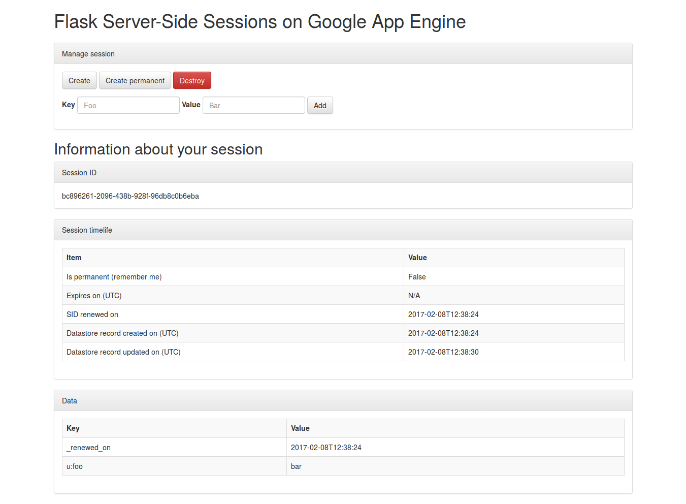

## Run Locally
1. Install and then initialize the [Google Cloud SDK](https://cloud.google.com/sdk/docs/).

2. Install dependencies in the project's lib directory.

  ```
  pip install -r requirements.txt -t lib
  ```

3. Run tests

  ```
  cd tests
  python runner.py ~/google-cloud-sdk
  ```

4. Start development server

  ```
  ./start.sh
  ```

  Then browse `http://localhost:8080`.

5. Deploy to GAE

  ```
  gcloud app deploy app.yaml --project flask-gae-sessions --verbosity=info
  ```

  ## Screenshot

  
